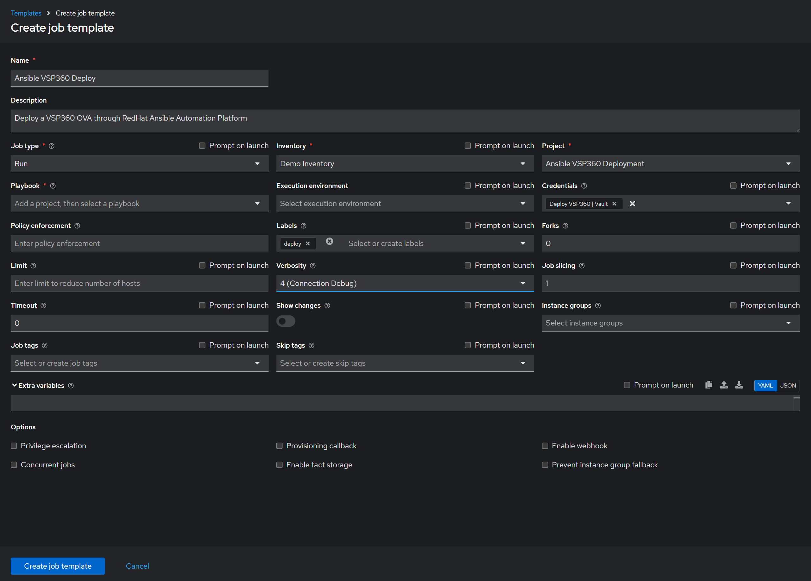
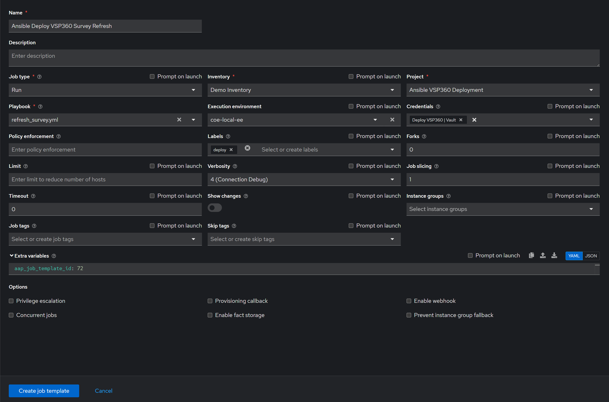
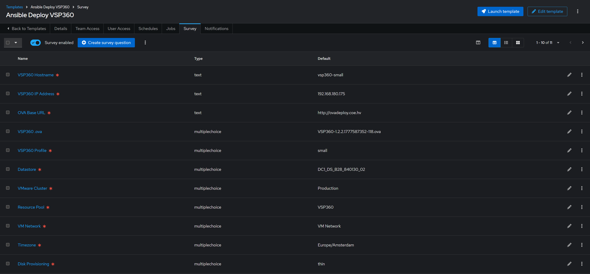

# VSP360 AAP Deployment Project

Automates the deployment of VSP360 OVA to VMware vCenter using Red Hat
Ansible Automation Platform (AAP). Includes a dynamic survey that
automatically refreshes available OVA files, VMware datastores, clusters,
and resource pools each evening via a scheduled job.

---

## Project Structure

    deploy_vsp360/
    ├── .gitignore
    ├── README.md
    ├── deploy_vsp360.yml              # Deploys VSP360 OVA to vCenter
    ├── update_aap_survey.yml          # Refreshes AAP survey with live data
    ├── ansible_vault_vars/
    │   └── ansible_vault.yml.example  # Copy to ansible_vault.yml and populate
    ├── vars/
    │   └── site_config.yml.example    # Copy to site_config.yml and populate
    └── images/
        ├── Ansible_VSP360_Deploy.png          # Deploy job template screenshot
        ├── Ansible_VSP360_Refresh_Survey.png  # Refresh survey job template screenshot
        └── Ansible_VSP360_Edit_Survey.png     # Survey defaults edit screenshot

---

## Prerequisites

- Red Hat Ansible Automation Platform 2.5+
- VMware vCenter access
- community.vmware collection available in your AAP execution environment
- A web server hosting OVA files capable of serving a JSON directory index.
  Nginx is recommended using autoindex_format json (see Step 4).
- Git repository connected to AAP as a project

---

## First Time Setup

### 1. Create the AAP Project

In AAP navigate to Projects and create a new project with the
following settings:

| Setting | Value |
|---|---|
| Name | Ansible VSP360 Deployment (or any name of your choice) |
| Source Control Type | Git |
| Source Control URL | https://github.com/Darren-Chambers/deploy-vsp360-ova |

AAP will automatically clone the repository when the project is saved
and on every subsequent sync.

### 2. Create site configuration

Copy the example file to create your local site configuration:

    cp vars/site_config.yml.example vars/site_config.yml

Edit vars/site_config.yml with your environment values. This file is
excluded from Git via .gitignore and must never be committed to version
control as it contains environment-specific values.

### 3. Create the vault file

Copy the example file to create your local vault:

    cp ansible_vault_vars/ansible_vault.yml.example ansible_vault_vars/ansible_vault.yml

Edit ansible_vault_vars/ansible_vault.yml with your credentials, then
encrypt it:

    ansible-vault encrypt ansible_vault_vars/ansible_vault.yml

Store the vault password in AAP as a Vault Credential — it will be
used automatically when jobs run. The encrypted vault file must not
be committed to version control.

### 4. Configure web server directory index

The survey refresh job requires the OVA file server to return a JSON
directory listing. Nginx is recommended. If using Nginx, configure it
with JSON autoindex.

OVA files must be placed in the web server's hosting directory before
the survey refresh job is run. How files are transferred is left to the
administrator — scp, ftp, shared storage, or any other method is
acceptable. The survey refresh job will automatically discover all OVA
files present in the directory at the time it runs.

If using Nginx, configure it with JSON autoindex:

    location / {
        root /var/www/html;
        autoindex on;
        autoindex_format json;
    }

Reload Nginx after changes:

    nginx -t && systemctl reload nginx

Verify it is working:

    curl http://<your-ova-server>/

Expected output:

    [
      { "name": "VSP360-x.x.x.ova", "type": "file", "mtime": "...", "size": 0 }
    ]

---

## Simple Setup (Manual Survey)

If you do not require automatic survey refresh from vCenter and the OVA
file server, the deploy_vsp360.yml playbook can be used standalone with
a manually configured survey in AAP. This removes the requirement for
the Refresh VSP360 Survey job template and the nightly schedule.

### Step 1 — Create the Deploy Job Template

Follow Step 1 from the AAP Setup section below.

### Step 2 — Create the survey manually

In AAP navigate to the Deploy VSP360 job template and select the
Survey tab. Add the following questions manually:

| Question | Variable | Type | Required |
|---|---|---|---|
| VSP360 Hostname | vsp360_hostname | Text | Yes |
| VSP360 IP Address | vsp360_ipaddress | Text | Yes |
| OVA Base URL | ova_base_url | Text | Yes |
| VSP360 .ova | vsp360_ova | Multiple Choice | No |
| VSP360 Profile | vsp360_profile | Multiple Choice | Yes |
| Datastore | datastore_name | Multiple Choice | Yes |
| VMware Cluster | cluster_name | Multiple Choice | Yes |
| Resource Pool | resource_pool | Multiple Choice | Yes |
| VM Network | vsp360_network | Multiple Choice | Yes |
| Timezone | vsp360_timezone | Multiple Choice | Yes |
| Disk Provisioning | disk_provisioning | Multiple Choice | Yes |

For Multiple Choice questions, enter the choices manually based on
your environment. The VSP360 Profile and Disk Provisioning choices
are fixed:

VSP360 Profile choices:

    small
    medium
    large

Disk Provisioning choices:

    thin
    thick
    eagerzeroedthick
    monolithicSparse
    monolithicFlat

### Step 3 — Deploy VSP360

Launch the Deploy VSP360 job template and complete the survey with
your environment values.

### Limitations of manual survey

- OVA file choices must be updated manually when new OVA files are added
- VMware choices (datastores, clusters, resource pools, networks) must
  be updated manually when your vCenter environment changes
- No nightly refresh means choices may become stale over time

---

## AAP Setup (Dynamic Survey)

### Step 1 — Create the Deploy Job Template

Create a job template in AAP with the following settings:

| Setting | Value |
|---|---|
| Name | Deploy VSP360 |
| Playbook | deploy_vsp360.yml |
| Credentials | Your Vault Credential |
| Inventory | localhost |
| Survey | Enabled (populated by the refresh job) |

Note the Job Template ID from the URL once created — you will need it
in Step 2.

In AAP navigate to the template, then check your browser address bar.
The URL will look similar to this:

    https://<aap-host>/execution/templates/job-template/70/details

In this example 70 is the Job Template ID. Make a note of your ID
before proceeding to Step 2.

---

### Step 2 — Create the Survey Refresh Job Template

Create a second job template with the following settings:

| Setting | Value |
|---|---|
| Name | Refresh VSP360 Survey |
| Playbook | update_aap_survey.yml |
| Credentials | Your Vault Credential |
| Inventory | localhost |

Add the following Extra Variable, replacing <template_id> with the
ID noted from Step 1:

    aap_job_template_id: <template_id>

This tells the refresh job which template survey to update. It must
be set before the job will run successfully.

---

### Step 3 — Run the Survey Refresh Job

Run the Refresh VSP360 Survey job template manually for the first time.
This will:

- Connect to the OVA file server and discover available OVA files
- Connect to vCenter and discover datastores, clusters, resource pools
  and networks
- Create the survey on the Deploy VSP360 template if it does not exist
- Populate all dropdown choices with live data
- Preserve any existing defaults

---

### Step 4 — Schedule the Survey Refresh Job

Add a schedule to the Refresh VSP360 Survey job template to keep the
survey choices up to date automatically:

| Setting | Value |
|---|---|
| Name | Nightly Survey Refresh |
| Start date/time | Today at 18:00 |
| Repeat frequency | Every day |
| RRULE | RRULE:FREQ=DAILY;BYHOUR=18;BYMINUTE=0;BYSECOND=0 |

---

### Step 5 — Set Survey Defaults

Once the survey refresh job has run successfully the survey will be
populated with live data. It is recommended to review and set the
default values before the template is used for the first time.

In AAP navigate to the Deploy VSP360 job template and select the
Survey tab. For each question, click the edit icon and set the default
value that best suits your environment. These defaults will be
preserved by the nightly survey refresh job and will be pre-selected
each time the deployment template is launched.

Typical defaults to consider setting:

| Question | Suggested default |
|---|---|
| VSP360 Hostname | A naming convention prefix for your environment |
| VSP360 IP Address | First available IP in your deployment range |
| OVA Base URL | Your OVA file server URL |
| VSP360 Profile | small, medium, or large based on typical deployment |
| Datastore | Your primary deployment datastore |
| VMware Cluster | Your primary deployment cluster |
| Resource Pool | Your primary resource pool |
| VM Network | Your primary VM network |
| Timezone | Your local timezone |
| Disk Provisioning | thin is recommended for most environments |

---

### Step 6 — Deploy VSP360

Launch the Deploy VSP360 job template. The survey will prompt for:

| Question | Description |
|---|---|
| VSP360 Hostname | Hostname for the new VM |
| VSP360 IP Address | IP address for the new VM |
| OVA Base URL | Base URL of the OVA file server |
| VSP360 .ova | Select from available OVA files |
| VSP360 Profile | Deployment size: small, medium, or large |
| Datastore | Select from available vCenter datastores |
| VMware Cluster | Select from available vCenter clusters |
| Resource Pool | Select from available vCenter resource pools |
| VM Network | Select from available vCenter networks |
| Timezone | Select the VM timezone |
| Disk Provisioning | Select the disk provisioning type |

---

## Profile Sizing

| Profile | vCPUs | Memory | Data Disk |
|---|---|---|---|
| small | OVA default | OVA default | OVA default |
| medium | 15 | 46 GB | 535 GB |
| large | 18 | 57 GB | 735 GB |

---

## Variables Reference

### vars/site_config.yml

Copied from vars/site_config.yml.example — not committed to Git.

| Variable | Used By | Description |
|---|---|---|
| aap_host | update_aap_survey.yml | AAP server URL |
| vcenter_hostname | both | vCenter server IP or hostname |
| vcenter_datacenter | both | vCenter datacenter name |
| ova_server_url | both | OVA file server base URL |
| vsp360_default_ip | update_aap_survey.yml | Default IP shown in survey |
| vsp360_netmask | deploy_vsp360.yml | VM network mask |
| vsp360_gateway | deploy_vsp360.yml | VM default gateway |
| vsp360_dns | deploy_vsp360.yml | VM DNS server |
| vsp360_domain | deploy_vsp360.yml | VM domain name |
| vsp360_ntp | deploy_vsp360.yml | VM NTP server |

### ansible_vault_vars/ansible_vault.yml

Copied from ansible_vault_vars/ansible_vault.yml.example — not committed to Git.

| Variable | Description |
|---|---|
| aap_user | AAP admin username |
| aap_pass | AAP admin password |
| vcenter_username | vCenter username |
| vcenter_password | vCenter password |
| vsp360_root_password | VSP360 appliance root password |

---

## Notes

- Both vars/site_config.yml and ansible_vault_vars/ansible_vault.yml
  must be created by copying their respective .example files and
  populating them with your values before running any jobs.
- Neither file should ever be committed to version control.
- The survey refresh job safely preserves existing survey defaults and
  all non-dynamic questions on every run.
- If no survey exists on the deploy template, the refresh job will create
  one automatically with sensible defaults.
- The refresh job will abort safely if no OVA files or vCenter objects
  are found, preventing the survey from being wiped.

---

## License

Copyright 2024 Hitachi Vantara

Licensed under the Apache License, Version 2.0. See [LICENSE](LICENSE)
for the full license text.

This software is provided on an "AS IS" BASIS, WITHOUT WARRANTIES OR
CONDITIONS OF ANY KIND. The authors accept no liability for any damages
arising from the use of this software. Use at your own risk.
